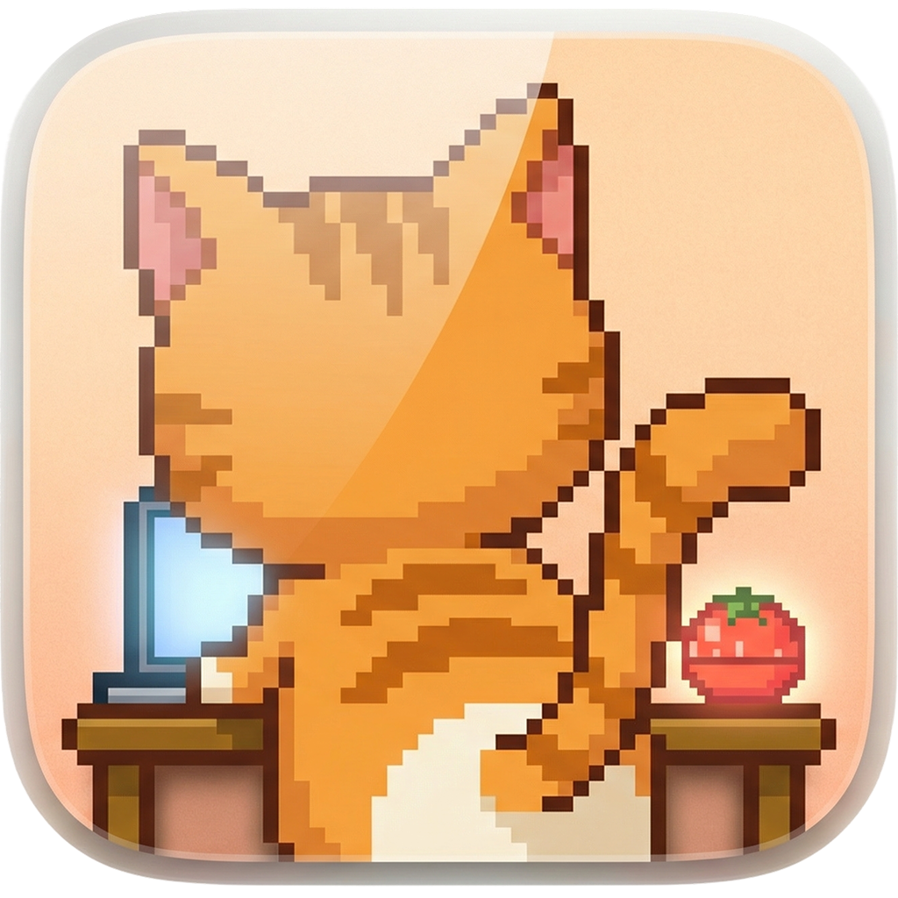

<p align="center">
  
</p>

<h1 align="center">ADHD Focus</h1>

<p align="center">
  <strong>A macOS focus assistant designed for ADHD users</strong>
</p>

<p align="center">
  
  
  
</p>

<p align="center">
  <strong>English</strong> · <a href="README_CN.md">中文</a>
</p>

---

### Features

**🐱 Pixel Cat Companion**
- A cute pixel orange tabby cat accompanies your work
- Unique pixel art scenes per focus mode (art studio, library, café, writing desk)
- Cat reacts to your state (working, resting, blocked)

**📱 Notch Interaction**
- All controls live in the MacBook notch area
- Click the notch to expand the control panel
- Collapsed view shows cat + Pomodoro countdown

**🚫 Smart App Blocking**
- Window-level overlay blocks distracting apps (without killing processes)
- One-click whitelist from the overlay
- 5-minute temporary allow

**🌐 Chrome URL Blocking**
- Chrome extension blocks distracting websites
- Custom URL black/white lists per mode
- Block page suggests alternative sites

**⏱ Pomodoro Timer**
- Customizable work/break/long-break durations
- Pause/resume by clicking the notch countdown
- Auto-unblock apps during breaks

**📊 Focus Statistics**
- Daily focus time, completed Pomodoros
- Block event details with app icons
- Focus streak tracking

**🤖 Auto-Trigger**
- Detects prolonged use of specific apps and suggests entering focus mode
- Configurable trigger delay (10s/30s/1min/5min)

**🎉 Celebration Effect**
- Screen edge glow when completing a Pomodoro work cycle

**🎯 4 Preset Modes**
- Deep Design — Figma/Sketch/PS + design websites
- Research — Browser + reference sites
- Communication — WeChat/Lark/Slack
- Writing — Notion/Notes

### Installation

**Download (Recommended)**

1. Download `ADHDFocus.dmg` from [GitHub Releases](https://github.com/Liko0223/ADHDFocus/releases)
2. Open the DMG and drag `ADHDFocus` to the `Applications` folder
3. First launch: **Right-click → Open** (required once to bypass Gatekeeper)
4. Grant Accessibility permission in System Settings → Privacy & Security

**Build from Source**

```bash
git clone https://github.com/Liko0223/ADHDFocus.git
cd ADHDFocus/ADHDFocus
brew install xcodegen  # if not installed
xcodegen generate
open ADHDFocus.xcodeproj
# Press Cmd+R to run
```

### Chrome Extension Setup

1. Open Chrome → `chrome://extensions`
2. Enable "Developer mode"
3. Click "Load unpacked"
4. Select the `ADHDFocus/ChromeExtension` folder

### System Requirements

- macOS 14.0+
- MacBook with notch (MacBook Pro/Air M-series)
- Accessibility permission (for app blocking)

---

## Tech Stack

- **UI**: SwiftUI + AppKit (NSPanel, NSWindow)
- **Data**: SwiftData
- **Notch**: NSScreen.safeAreaInsets + custom NSPanel
- **Animation**: Canvas pixel art + TimelineView
- **Chrome**: Manifest V3 Extension + local HTTP server
- **Build**: xcodegen

## License

MIT
